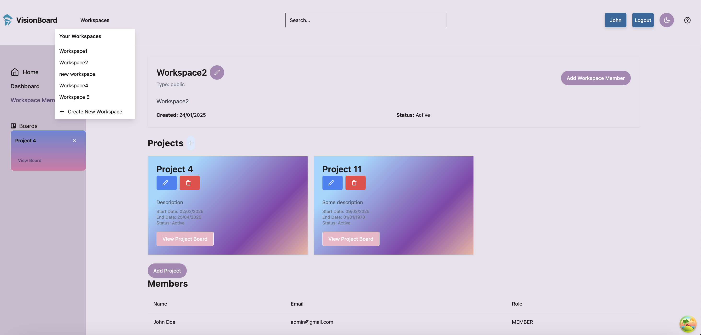

# Project Management Application

This application allows users to manage workspaces, companies, projects, tasks, and comments. Users can create, update, and manage these entities through a user-friendly interface.

## Author

[Shubhangi Naik](https://www.linkedin.com/in/shubhanginaik)

The current template tech stack: React, TypeScript, Tailwind, Shadcn, tanstack/react-query.



## Requirements

Create an interface to represent the requirements of your backend project.

Focus on the following principles:

- Prioritize High-Impact Features

  - Identify and implement the most critical functionalities first.
  - Ensure the interface aligns with the core objectives of the backend project.

- Efficient Time Management

  - Avoid over-investing time in visual styling or non-essential tasks.
  - Address low-priority issues and bugs only after completing high-priority features.

- Clarity and Functionality
  - Design the interface to be user-friendly and intuitive, but don't sacrifice functionality for aesthetics.
  - Document any trade-offs made for prioritization.

# Workspace Management Application

- This application allows users to manage workspaces, companies, projects, tasks, and comments. Users can create, update, and manage these entities through a user-friendly interface.

# Features

## Workspace Admin

- Add Company: Create a new company.
- Update Own Company: Update the details of the company you own.
- Add Project: Create a new project within a workspace.
- update projects
- delete projects
- Add Task: Create a new task within a project.
- Update Task: Update the details of an existing task.
- Add Comment: Add a comment to a task.
- Get all commants and activities of a task
- Create New Workspace: Create a new workspace.
- See Activities: View the activity log for the workspace.
- Add New User to Workspace: Add a new user to the workspace.
- Invite User: Invite users from other workspaces he is part of.
- Delete Workspace User: Remove a user from the workspace.

## Member(can be Manager, Team members)

- Create Company: Create a new company.
- Create New Workspace: Create a new workspace.
- Get All Workspaces: Retrieve all workspaces the member is part of.
- Get Projects: Retrieve all projects within a workspace he is part of.
- Add Task: Create a new task within a project.
- Update Task: Update the details of an existing task.
- Assign a user to a task
- Add Comment on Task: Add a comment to a task.
- Get All Activities: View the activity log for the workspace.
- Get All Members: Retrieve all members within a workspace.

## Technologies Used

1. Frontend

### React Router: A library for routing in React applications.

### TypeScript: A typed superset of JavaScript that compiles to plain JavaScript.

### Tanstack query

### React: A JavaScript library for building user interfaces.

### React Query: A library for fetching, caching, and updating asynchronous data in React.

### Shadcn for readymade UI componenets

## Tailwind CSS: A utility-first CSS framework for rapid UI development.

2. Backend

### Spring boot

### JWT

### Postgresql

Installation

1. Clone the repository:

```bash
   git clone https://github.com/shubhanginaik/fs19_frontend_pma.git
   cd fs19_frontend_pma
```

2. Install dependencies:

```bash
npm install
```

3. Start the development server:

```bash
yarn dev

```

Usage

- Create a Company:

Navigate to the "Create Workspace" page through workspace dropdown in the header.
Click on the "New Company" button.
Enter the company name and click "Save".

- Update a Company:

Select a company from the dropdown.
Click on the "Update Company" button.
Enter the updated company name and click "Save".

- Create a Workspace:

Enter the workspace name, description, and type.
Select a company from the dropdown.
Click on the "Create Workspace" button.

- Update a Workspace:

Navigate to the workspace you want to update.
Click on the "Edit" button.
Update the workspace details and click "Save".

- Add a Project:

Navigate to the workspace.
Click on the "Add Project" button.
Enter the project details and click "Save".

- Add a Task:

Navigate to the project.
Click on the "Add Task" button.
Enter the task details and click "Save".

- Update a Task:

Navigate to the task(click on the task).
It will open a task details dialog
Update the task details and click "Save".

- Add a Comment:

Navigate to the task.
Enter your comment in the comment box and click "Add Comment".

- See Activities:

Navigate to the workspace.
Click on the "Activities" tab to view the activity log.
Add New User to Workspace:

- Add new User:

Navigate to the workspace Members page.
Click on the "Add User" button.
Enter the user details and click "Add".

- Delete Workspace User:

Navigate to the workspace Members page.
Click on the "Delete" button.

- Invite User:

Navigate to the workspace.
Click on the "Invite User/add user" button.
Select a user from the list of available users.

- License
  This project is licensed under the MIT License.
